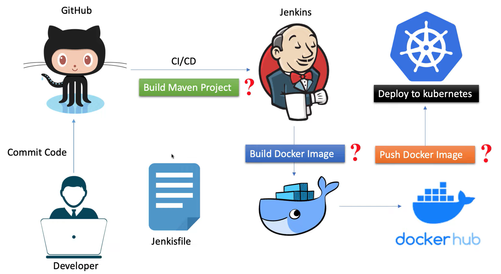

# 🚀 DevOps CI/CD Pipeline with Jenkins, Docker, and Kubernetes



## 📖 Project Overview

This project sets up a complete **CI/CD pipeline** using the following tools:

- **Jenkins** for continuous integration and delivery
- **Docker** for containerization
- **Docker Hub** as the container registry
- **Kubernetes** for application deployment
- **Maven** for building Java applications

The pipeline automates the entire process from **code commit** to **deployment in Kubernetes**. It is designed for simplicity, scalability, and flexibility.

---

## 🔄 CI/CD Workflow

### 1. 👨‍💻 Developer Commits Code
- A developer pushes code changes to the `main` branch of a GitHub repository.

### 2. 🤖 Jenkins Triggers the Pipeline
- Jenkins detects the change (via webhook or polling) and triggers the pipeline.
- The pipeline is defined in a `Jenkinsfile` at the root of the repository.

### 3. 🔨 Maven Build Stage
- Jenkins checks out the source code and runs a Maven build:
   - Executes `mvn clean install`
   - Packages the Java application
   - Extracts the version from `pom.xml` to tag the Docker image

### 4. 🐳 Docker Image Build
- A Docker image is built from the Maven artifact.
- Tagged as:  
  `dockerhub-username/devops-integration:<maven-version>`

### 5. ☁️ Push Image to Docker Hub
- Jenkins uses Docker Hub credentials to authenticate and push the image.

### 6. ☸️ Deploy to Kubernetes
- Jenkins uses `kubectl apply -f deployment.yml` to deploy the image to Kubernetes.

---

## 🧰 Technologies Used

| Tool/Service      | Role                                 |
|-------------------|--------------------------------------|
| **GitHub**        | Version control                      |
| **Jenkins**       | CI/CD automation                     |
| **Maven**         | Build tool for Java applications     |
| **Docker**        | Containerization                     |
| **Docker Hub**    | Image registry                       |
| **Kubernetes**    | Container orchestration              |
| **Kind**          | Local Kubernetes cluster             |

---

## 🛠️ Project Setup

### 1. **Kind Cluster Setup**
- A local Kubernetes cluster is created using [Kind (Kubernetes in Docker)].
- Scripts to set up the Kind cluster are provided in the folder: `k8s/kind`

### 2. **Jenkins Deployment on Kubernetes**
- Jenkins is deployed in the Kind cluster for local CI/CD testing.
- The folder: `k8s/jenkins` contains automation scripts and Kubernetes YAML manifests for Jenkins deployment.


### 3. **Pipeline Configuration**
- The `Jenkinsfile` at the root of the repo defines all CI/CD steps:
- Maven build
- Docker image build
- Docker Hub push
- Kubernetes deployment

---
## 🔧 Setup Instructions

### Prerequisites

- Docker installed and running
- Jenkins installed (or deployed using the provided scripts)
- Kind installed (`https://kind.sigs.k8s.io/`)
- kubectl configured

### Steps

#### 1. **Clone the Repository**:
 ```bash
 git clone https://github.com/sublime-exp/devops-automation.git
 cd devops-automation
 ````
#### 2. **Create K8S Cluster:**:
```bash
cd k8s/kind
./create-kind-cluster.sh
```

#### 3. **Build Custom Jenkins Image:**
```bash
cd ../jenkins
./build-jenkins.sh
```

#### 4. **Deploy Jenkins on Kubernetes:**
```bash
cd ../jenkins
./deploy-jenkins.sh
```

#### 5. **Access Jenkins UI::**
```bash
kubectl port-forward svc/jenkins 8080:8080
```
get the generated password from the container logs

_open `http://localhost:8080` to configure Jenkins pipeline_


#### 6. **Add Docker Hub Credentials in Jenkins**

To allow Jenkins to push Docker images to Docker Hub, you need to add your Docker Hub credentials as a secret in Jenkins:

1. Open **Jenkins Dashboard**.
2. Navigate to:  
   `Manage Jenkins` → `Manage Credentials` → `(global)` → `Add Credentials`
3. Fill in the form with the following values:
  - **Kind**: `Secret text`
  - **Secret**: *(Your Docker Hub password or access token)*
  - **ID**: `dockerhub-pwd`
4. Click **OK** to save the credential.

> ✅ The ID `dockerhub-pwd` must match the one used in the `Jenkinsfile`.


#### 7. **Configure Docker Hub Username in Jenkins and Pipeline Files**

To correctly tag and push Docker images, you must update the Docker Hub username in a few places:

1. **Edit `Jenkinsfile`**
  - Locate the Docker image tag line:
  - Replace `your-dockerhub-username` with your actual Docker Hub username.

2. **Edit `jenkins/build-jenkins.sh`**
  - This script builds the custom Jenkins Docker image.
  - Update the Docker tag:

3. **Edit `k8s/jenkins/jenkins.yml`**
  - Ensure the custom image in the deployment spec reflects your username:

4. **Edit `deployment.yml`**
  - Ensure the custom image in the deployment spec reflects your username:

> 🔁 Make sure these changes are consistent across your files to avoid image push/pull issues.
#### 8. **Push Code to GitHub**

Trigger the pipeline by pushing to the main branch.
